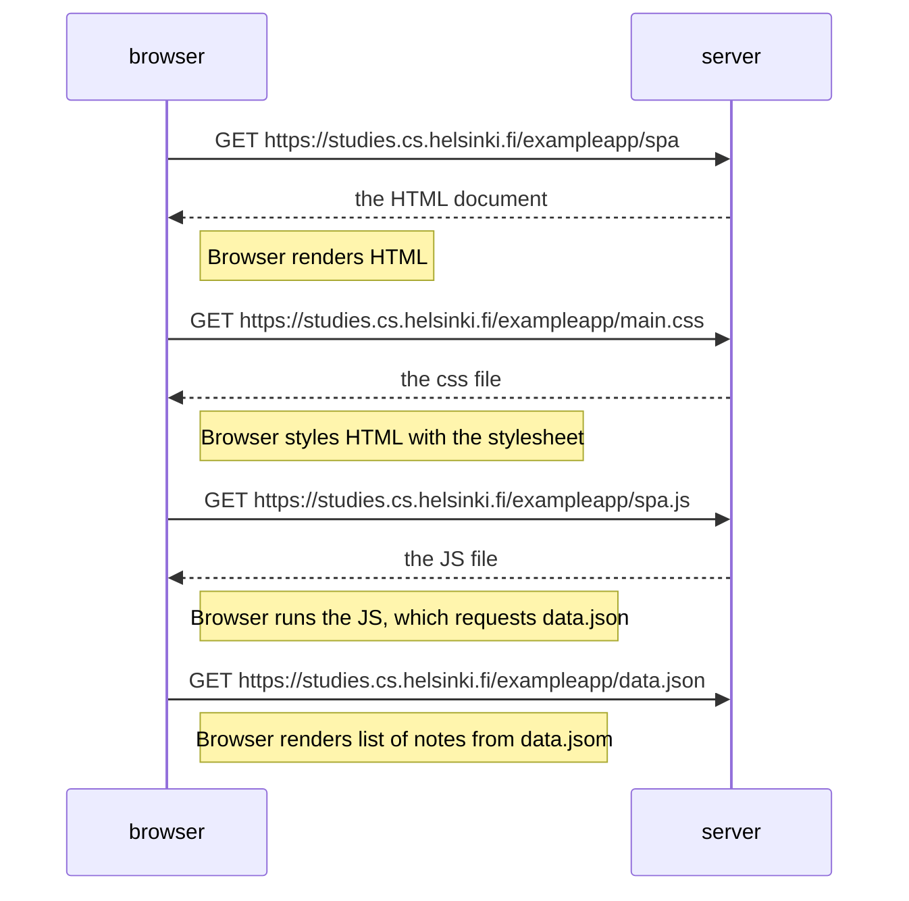

```mermaid
sequenceDiagram
    participant browser
    participant server

    browser->>server: GET https://studies.cs.helsinki.fi/exampleapp/spa
    server-->>browser: the HTML document
    Note right of browser: Browser renders HTML
    browser->>server: GET https://studies.cs.helsinki.fi/exampleapp/main.css
    server-->>browser: the css file
    Note right of browser: Browser styles HTML with the stylesheet
    browser->>server: GET https://studies.cs.helsinki.fi/exampleapp/spa.js
    server-->>browser: the JS file
    Note right of browser: Browser runs the JS, which requests data.json
    browser->>server: GET https://studies.cs.helsinki.fi/exampleapp/data.json
    Note right of browser: Browser renders list of notes from data.jsom

```