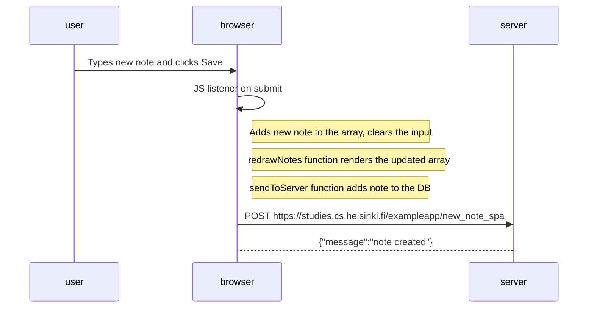

```mermaid
sequenceDiagram
    participant user
    participant browser
    participant server

    user->>browser: Types new note and clicks Save
    browser->>browser: JS listener on submit
    Note right of browser: Adds new note to the array, clears the input
    Note right of browser: redrawNotes function renders the updated array
    Note right of browser: sendToServer function adds note to the DB
    browser->>server: POST https://studies.cs.helsinki.fi/exampleapp/new_note_spa
    server-->browser: {"message":"note created"}
```